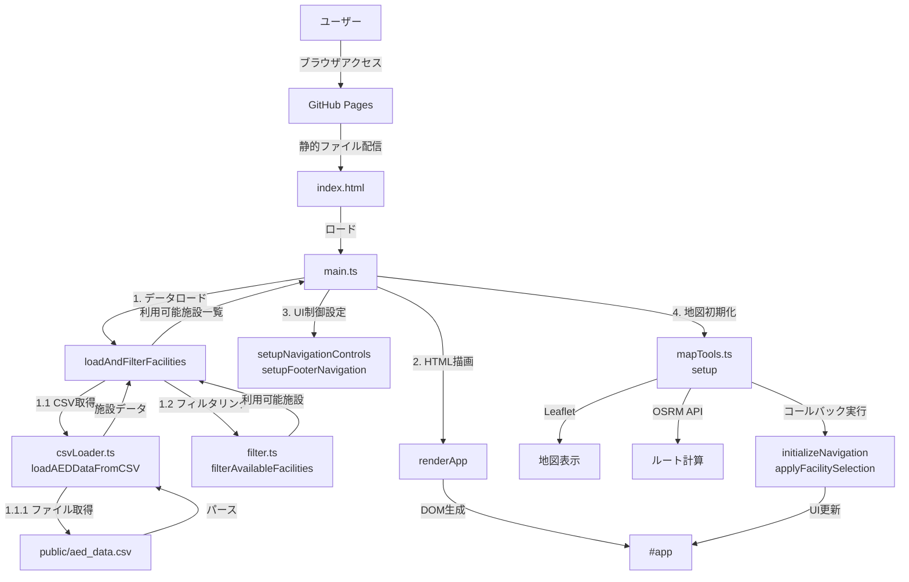

# アーキテクチャ図

以下は本プロジェクトのアーキテクチャを示すマーメイド記法の図です：

```mermaid
graph TD
    A[ユーザー] -->|ブラウザアクセス| B[GitHub Pages]
    B -->|静的ファイル配信| C[index.html]
    C -->|ロード| D[main.ts]
    D -->|1. データロード| E[loadAndFilterFacilities]
    E -->|1.1 CSV取得| F[csvLoader.ts<br/>loadAEDDataFromCSV]
    F -->|1.1.1 ファイル取得| G[public/aed_data.csv]
    G -->|パース| F
    F -->|施設データ| E
    E -->|1.2 フィルタリング| H[filter.ts<br/>filterAvailableFacilities]
    H -->|利用可能施設| E
    E -->|利用可能施設一覧| D
    D -->|2. HTML描画| I[renderApp]
    I -->|DOM生成| J[#app]
    D -->|3. UI制御設定| K[setupNavigationControls<br/>setupFooterNavigation]
    D -->|4. 地図初期化| L[mapTools.ts<br/>setup]
    L -->|Leaflet| M[地図表示]
    L -->|OSRM API| N[ルート計算]
    L -->|コールバック実行| O[initializeNavigation<br/>applyFacilitySelection]
    O -->|UI更新| J
```

この図は、ユーザーの操作から地図描画やデータフィルタリング、UI更新までのフローを示しています。