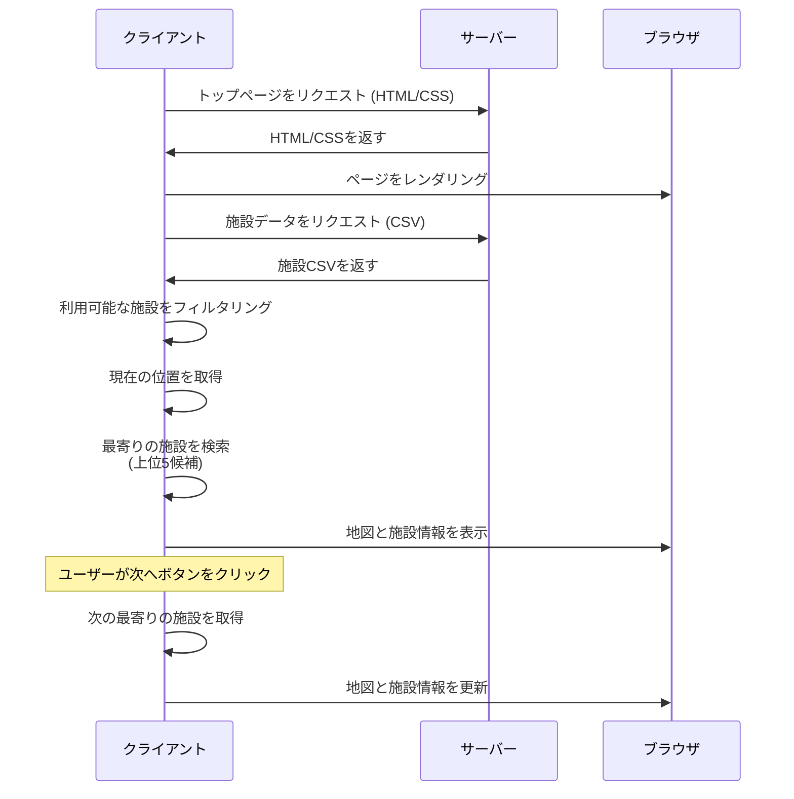

# AEDナビゲーション - シーケンス図

## ウェブアプリケーションフロー

## プロセス概要

1. **初期ロード**: クライアントがHTML/CSSをリクエストし受信
2. **データ取得**: クライアントが施設データを取得 (CSV形式)
3. **クライアント側フィルタリング**: 利用可能な施設が絞り込まれる
4. **位置検出**: 現在の位置を取得し、上位5つの最寄り施設を特定
5. **表示**: 地図と施設情報が表示される
6. **ナビゲーション**: 「次へ」ボタンが残りの候補を循環

